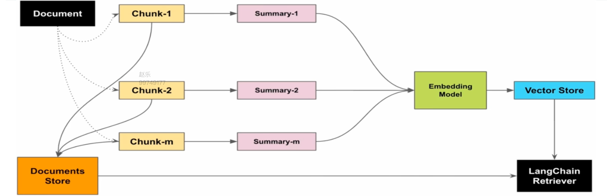
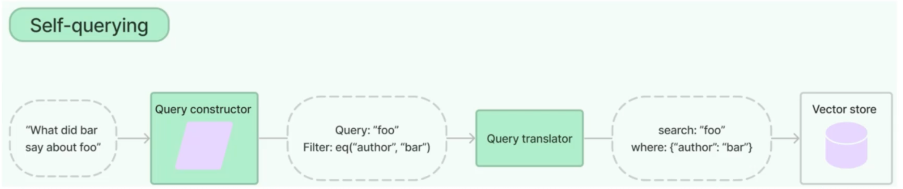

# Advanced RAG：针对问题选择检索优化

基础 RAG 已经能工作，但“能回答”不等于“每次都找对”。这篇不把所有技术都当成必选项，而是从一个具体问题出发：**基线在哪一步失手？应该在索引、查询、召回还是后处理阶段补它？**

示例代码在本目录，公共模型和 embedding 配置来自 [src/langchaindemo/model.py](../langchaindemo/model.py)。多数示例使用 [deepseek.md](deepseek.md)，需要模型、embedding 和部分示例的 rerank 服务。模型回答、排名、耗时和块数会随配置变化，文中的输出只用于说明流程。

## 1. 先定位失败的位置

一条完整的 RAG 请求可以画成：

```text
文档 → 分块/索引 → 查询改写 → 召回 → 重排序/压缩 → Prompt → 答案
  ↑                                                  ↓
          离线阶段                         在线阶段
```

常见问题和对应方向：

| 现象 | 可能的补救 |
|---|---|
| 宽泛问题召回不全 | 摘要索引、Multi-Query、RAG-Fusion |
| 命中句子但上下文断裂 | 父子索引 |
| 用户问法和文档写法差距大 | 假设性问题索引、查询改写 |
| 必须限定年份、作者或类别 | SelfQuery 元数据过滤 |
| 专有名词没命中 | BM25 + 向量混合检索 |
| 候选很多但前几名不准 | rerank |
| 块相关但内容太长 | context compression |
| 一问包含多个独立目标 | 问题分解 |

不要在没有基线的情况下同时打开所有开关。固定一组问题，记录 Recall@k、MRR、上下文长度、延迟和成本，才知道改动是否真的有效。

## 2. 索引阶段：改变“被检索的中间层”

### 2.1 摘要索引：用概括承接宽泛问题

正文块适合事实检索，但“这家公司有哪些动态”这种问题很宽泛。可以在离线阶段为每个块生成摘要：

```text
原始块 → LLM 生成摘要 → 摘要向量库
                         ↘ doc_id → 原始块存储
```

[summary.py](summary.py) 使用 `MultiVectorRetriever`：向量库保存摘要，字节存储保存原始 Document。用户问题匹配摘要后，retriever 根据 `doc_id` 返回原文，而不是把摘要直接当答案依据。

```python
summary_docs = [
    Document(page_content=summary, metadata={"doc_id": doc_id})
    for summary, doc_id in zip(summaries, doc_ids)
]
retriever.vectorstore.add_documents(summary_docs)
retriever.docstore.mset(list(zip(doc_ids, docs)))
```

摘要索引要为每个块额外调用一次 LLM，适合宽泛查询多、索引更新不频繁的知识库。事实非常具体时，普通正文检索可能已经够用。



### 2.2 父子索引：小块负责找，大块负责答

小块检索精确，但上下文容易断；大块上下文完整，却可能被无关内容稀释。父子索引把两件事分开：

```python
parent_splitter = RecursiveCharacterTextSplitter(chunk_size=1024)
child_splitter = RecursiveCharacterTextSplitter(chunk_size=256)
retriever = ParentDocumentRetriever(
    vectorstore=vectorstore,
    docstore=InMemoryStore(),
    child_splitter=child_splitter,
    parent_splitter=parent_splitter,
)
```

子块向量进入向量库，命中后按所属 id 返回父块。它不需要摘要调用，但父块可能比普通结果长，仍要控制最终上下文数量。`ParentDocumentRetriever` 与 `MultiVectorRetriever` 都是“小的中间层 → 原始内容”的思路，区别在于父子索引的中间层仍是原文切片。

### 2.3 假设性问题索引：让问题匹配问题

文档写的是陈述句，用户输入的是问句，二者表达方式可能差很多。离线时让 LLM 为每个块生成几个“这段内容能回答什么问题”，把这些问题向量化，并用 id 指回原文：

```python
class HypotheticalQuestions(BaseModel):
    questions: list[str]

question_chain = (
    {"doc": lambda doc: doc.page_content}
    | prompt
    | model.with_structured_output(
        HypotheticalQuestions,
        extra_body={"thinking": {"type": "disabled"}},
    )
    | (lambda result: result.questions)
)
```

这里的 `with_structured_output` 让结果直接成为带 `questions` 字段的对象，不必手工从文本中抠 JSON。`extra_body` 是当前 DeepSeek 配置下的私有兼容参数，不是所有模型都需要；换模型时应重新确认 function calling 和 thinking 的支持情况。

它和 HyDE 不一样：HyDE 在线为用户问题生成假设性答案；这里是离线为文档生成假设性问题。前者改查询，后者改索引。

### 2.4 SelfQuery：把自然语言拆成 query 和 filter

当用户问“2024 年评分 9 分以上的 AI 文章”时，年份和评分是结构化条件，不应该只靠向量距离判断。SelfQueryRetriever 让模型生成：

```text
query  = “AI 文章”
filter = year == 2024 AND rating >= 9
```

文档必须有一致的 metadata：

```python
Document(
    page_content="百度发布 Apollo 开放平台...",
    metadata={"year": 2024, "rating": 9.2, "genre": "AI/自动驾驶", "author": "百度"},
)
```

再用 `AttributeInfo` 告诉模型字段含义和类型：

```python
retriever = SelfQueryRetriever.from_llm(
    model,
    vectorstore,
    "技术文章简述",
    meta_field_info,
)
```

`filter` 是硬条件，`query` 是软的语义排序。生产环境必须验证模型生成的过滤表达式，权限字段尤其不能只依赖 LLM。



### 2.5 四种索引怎么选

| 技术 | 中间层 | 主要解决 |
|---|---|---|
| 摘要索引 | LLM 摘要 | 宽泛概括问题 |
| 父子索引 | 子块 | 上下文断裂 |
| 假设性问题索引 | 预生成问句 | 问法与陈述差异 |
| SelfQuery | metadata 条件 | 年份、作者、评分等过滤 |

它们可以组合，但组合会增加索引成本、调试难度和在线上下文长度。先根据失败样本选一种。

## 3. 检索前：先把问题处理好

### 3.1 Enrich：补齐业务槽位

“帮我订机票”不是一个完整查询。`enrich.py` 用业务模板列出起点、终点、时间、座位等级和座位偏好，让模型逐轮追问，直到生成完整问题。

这属于槽位填充和对话交互，不是所有 RAG 都需要的检索优化。它适合订票、工单、表单等信息不完整的业务；补全结束后，完整问题才进入 retriever。

示例使用 `RunnableWithMessageHistory` 保存多轮历史。它适合演示原理，但当前 LangChain 版本可能提示迁移到 LangGraph；多用户不能让所有 session 返回同一份 history。

### 3.2 Multi-Query：同一个意图换几种问法

一次查询只提供一个角度。Multi-Query 先让 LLM 生成多个查询，再分别检索并去重：

```text
用户问题 → query A ─┐
         → query B ─┼→ 同一 retriever → 合并去重
         → query C ─┘
```

它更容易扩大召回面，但会增加模型调用和检索次数，合并后的候选也可能变杂。只做去重不等于完成排序；需要更精确时看 RAG-Fusion 或 rerank。

### 3.3 Decomposition：把复杂问题拆开

“这家公司什么时候成立、有哪些产品、最近有什么变化”包含多个子目标。问题分解先生成子问题，每个子问题独立检索和回答，再把子答案作为上下文交给最终模型。

[decomposition.py](decomposition.py) 用 `BaseRetriever` 封装这套流程。它要额外调用生成子问题和解决子问题的 LLM，延迟会明显增加；简单事实问题不值得使用。

## 4. 检索阶段：让不同检索方式互补

### 4.1 Hybrid Search：BM25 + 向量

向量检索擅长理解语义，BM25 擅长命中特定词、编号和专有名词。混合检索让两路并行：

```text
问题 → BM25 关键词检索 ─┐
      向量语义检索 ────┼→ RRF/加权融合 → 候选集
```

中文 BM25 不能简单按空格切词，通常需要 jieba 等分词器；否则一整段中文可能被当成一个词。`hybrid_search.py` 展示了自定义分词和 `EnsembleRetriever` 的组合。

`weights` 表示两路在融合中的权重，不是“各取多少条”。权重、k 和分词方式都应在固定问题集上调。

### 4.2 RRF：只比较排名

不同检索器的原始分数不可直接相加：BM25 分数和向量距离不在同一尺度。RRF 只使用排名：

\[
score(d)=\sum_i \frac{w_i}{c+rank_i(d)}
\]

其中 `w_i` 是检索路权重，`c` 是平滑常数。一个文档被多路检索到且排名靠前，就会得到更高融合分。RRF 不需要把各路分数校准到同一尺度，但也会丢掉原始分数的强弱信息。

`rag_fusion.py` 先生成多条查询，再收集各路结果，用 `dumps(doc.model_dump())` 作为去重键，最后取融合后的 TopK。不要把“多查询”与“多检索源”混成一个概念：前者扩展问法，后者扩展来源，二者可以叠加。

## 5. 检索后：把候选收口

### 5.1 Rerank：给候选重新排序

向量检索可以把候选捞得多一些，再让专门的 rerank 模型逐个比较“查询 × 文档”：

```python
candidate_docs = vector_retriever.invoke(question)
reranked_docs = reranker.compress_documents(candidate_docs, question)
```

[model_remark.py](model_remark.py) 使用 `RERANK_*` 配置调用 OpenRouter 的 Cohere-compatible 接口。`top_n` 控制保留数量，通常能把候选从 6 个收口到 3 个，但这不是准确率保证。

如果还要按分数阈值过滤，过滤后的列表必须真正传给最终 Prompt：

```python
threshold_docs = [
    doc for doc in reranked_docs
    if doc.metadata["relevance_score"] >= threshold
]
```

阈值要根据实际分数分布和拒答要求标定。`ContextualCompressionRetriever` 可以把基础 retriever 和 reranker 组合起来；它仍需要外部 rerank 服务可用。

### 5.2 RAG-Fusion 与 rerank 的关系

RRF 是不依赖模型的排名融合，rerank 是模型级的逐文档精排。可以先用 RRF 从多路结果中取候选，再用 rerank 收口；也可以只使用其中一种，取决于延迟和成本预算。

### 5.3 Context Compression：块里只留下相关内容

重排序回答“保留哪些块”，上下文压缩回答“每个块保留哪部分”。[context_compress.py](context_compress.py) 展示四种方式：

| 压缩器 | 特点 |
|---|---|
| `LLMChainExtractor` | LLM 摘出相关句，较准但贵 |
| `LLMChainFilter` | LLM 判断整块是否保留 |
| `EmbeddingsFilter` | 向量阈值过滤，快但粗 |
| `DocumentCompressorPipeline` | 分句、去重、相关性过滤组合 |

压缩结果仍要放进最终回答 chain，不能只打印“压缩前/后”就断言答案变好了。至少比较上下文长度、命中证据和答案忠实度。压缩会删掉内容，涉及数字、条件和例外时要特别检查是否误删。

## 6. 评估：优化不是看起来更聪明

给每个问题准备标准答案和必要证据，至少记录：

- **Recall@k**：相关证据是否进入前 k 个结果；
- **MRR**：第一个相关结果排得多靠前；
- **上下文长度**：传给模型多少字符/token；
- **延迟与调用次数**：查询改写、摘要、rerank 都会增加成本；
- **答案忠实度和完整性**：答案是否能在证据中找到，是否漏掉必要信息。

RAG 三元组常把评估拆成上下文相关性、答案忠实度和答案相关性。RAGAS、TruLens 等工具可以辅助评测，但自动评分也需要人工抽查，不应把一个分数当成事实。

## 7. 一条实际调优顺序

```text
固定问题集和基线
    ↓
先检查分块与 metadata
    ↓
问题角度不足？Multi-Query / RAG-Fusion
字面词漏召回？Hybrid Search
上下文断裂？Parent-Child
候选排序不稳？Rerank
块太长或重复？Context Compression
    ↓
比较召回、忠实度、延迟和成本
```

摘要索引、假设性问题索引和 Decomposition 会引入额外 LLM 调用；SelfQuery 还会引入过滤表达式风险。没有问题集和指标时，不要仅凭一次回答决定某种技术“更好”。
