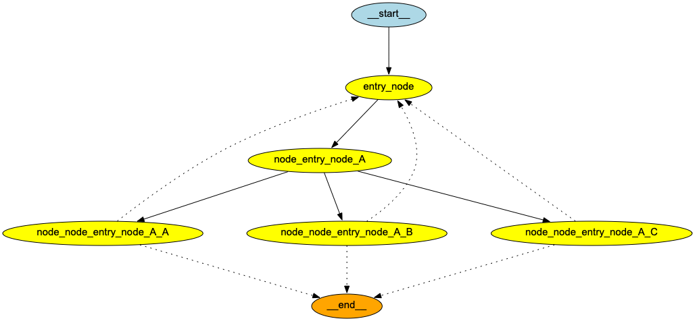
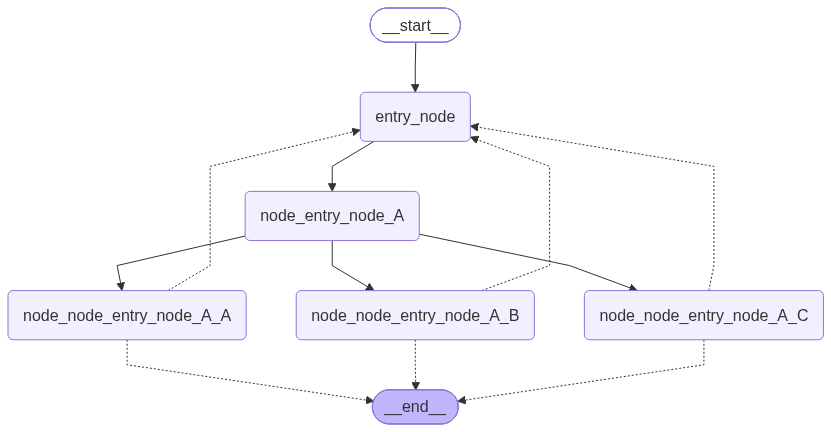
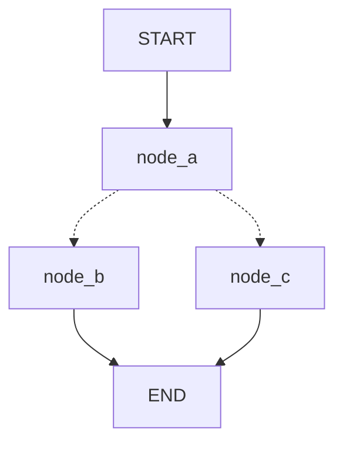
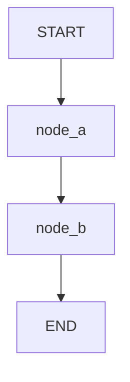
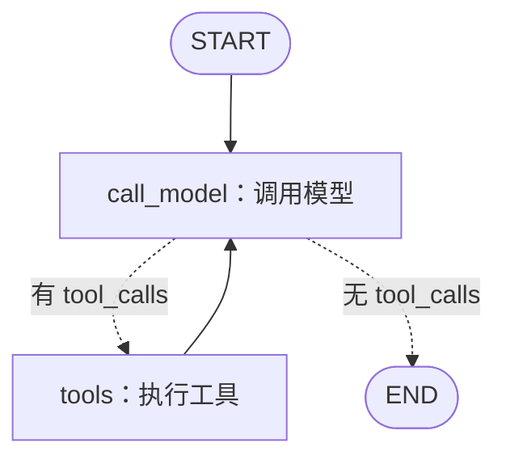

# LangGraph 图可视化：从代码看到执行流程

上一篇笔记介绍了 State、Node 和 Edge。这一篇继续回答一个很实用的问题：**已经写好的 LangGraph，怎样把它画出来？**

示例代码是 [Visualization.py](Visualization.py)。它先随机创建一张包含多个节点的图，然后把同一张图分别渲染成两张 PNG：

- [可视化图1.png](可视化图1.png)：使用 Graphviz 绘制；
- [可视化图2.png](可视化图2.png)：把 Mermaid 图定义交给 Mermaid 服务绘制。

这两张图片表达的是同一张图的结构，区别主要在于绘图工具和视觉样式。

后续内容在可视化的基础上继续介绍并行分支、`Send`、`Command`、Checkpoint 和运行时配置。新增的 [ToolNode.py](ToolNode.py) 对应[第 61 节起的工具调用笔记](#61-toolnodepy让模型通过图调用工具)，重点是读懂“模型决定调用什么工具 → 工具执行 → 模型继续回答”的循环。

## 1. 为什么要可视化

图变复杂以后，只看 `add_node()` 和 `add_edge()` 很容易漏掉连接关系。可视化可以帮助我们：

- 检查入口和出口是否正确；
- 找到某个节点的下游节点；
- 观察条件边、分支和循环；
- 在调试前先确认“程序实际构建出的图”是否符合预期。

可视化的是**图的结构**，不是一次运行的完整日志。它通常能告诉我们“哪些节点可能连接”，但不会告诉我们某一次调用实际走了哪条条件分支。

## 2. 先从示例还原这张图

代码先声明状态：

```python
class State(TypedDict):
    messages: Annotated[list, add_messages]
```

这表示图中会传递一个 `messages` 字段，并使用 `add_messages` 合并消息。可视化本身不会显示 State 的值；State 仍然负责在运行时携带数据。

然后定义一个可以作为节点使用的类：

```python
class MyNode:
    def __init__(self, name: str):
        self.name = name

    def __call__(self, state: State):
        return {"messages": [("assistant", f"Called node {self.name}")]}
```

`__call__()` 让 `MyNode` 的实例可以像函数一样被 LangGraph 调用。每个实例的名字不同，所以图片中的节点名称也不同。

图的入口固定为 `entry_node`：

```python
builder = StateGraph(State)
builder.add_node("entry_node", MyNode("entry_node"))
builder.add_edge(START, "entry_node")
```

之后的 `add_fractal_nodes()` 会递归创建名称类似下面的节点：

```text
node_entry_node_A
node_entry_node_B
node_entry_node_C
```

名称中的 `A、B、C` 只是示例代码给分支起的名字，不代表 LangGraph 的特殊语法。最后，代码将图编译：

```python
app = build_fractal_graph(3)
```

`compile()` 返回的 `app` 才是可以 `invoke()`、`stream()` 或继续检查的可运行图。

## 3. 图片中的节点和箭头怎么看





阅读图片时，可以先只找四种东西：

| 图中元素 | 含义 | 示例 |
|---|---|---|
| `__start__` / `__end__` | 图的入口和出口 | `START`、`END` 的内部表示 |
| 普通节点 | 会执行 Python 函数或可调用对象 | `entry_node`、`node_entry_node_A` |
| 实线箭头 | 普通边或明确的连接 | `entry_node → node_entry_node_A` |
| 虚线箭头 | 条件边等可能的路由关系 | 从分支节点指向入口或出口 |

图中从 `__start__` 到 `entry_node` 的箭头说明：执行从入口节点开始。`entry_node` 再连接到多个子节点，表示后面可能有多个分支。指向 `__end__` 的连接表示流程可以结束。

Graphviz 和 Mermaid 对实线、虚线、节点形状的处理略有不同，因此两张图看起来不完全一样，但它们描述的是同一个已编译图。

## 4. `get_graph()`：拿到图的结构

```python
graph_view = app.get_graph()
```

`app` 是编译后的可执行图，`get_graph()` 返回用于检查和绘制的图视图。可以把它理解成“把编译结果中的节点和边取出来”。

它还适合在调试时查看节点名称：

```python
graph_view = app.get_graph()
print(graph_view.nodes)
print(graph_view.edges)
```

不同 LangGraph 版本对内部对象的打印格式可能略有差异，所以初学时更推荐直接调用绘图方法，而不是依赖内部属性的具体结构。

## 5. 方式一：使用 Graphviz 生成 PNG

示例代码是：

```python
from IPython.display import Image, display

display(Image(graph_view.draw_png(output_file_path="./可视化图1.png")))
```

这里发生了两件事：

1. `draw_png()` 根据图结构生成 PNG，并写入 `output_file_path`；
2. `IPython.display.Image` 将生成的图片包装成可以在 Notebook 中显示的对象。

这种方式通常需要安装 Python 依赖以及操作系统层面的 Graphviz。只安装 Python 包还不够，因为真正绘图时需要 `dot` 可执行程序。

在 macOS 上可以使用：

```bash
brew install graphviz
```

Windows 和 Linux 可以从 [Graphviz 官网](https://graphviz.org/download/) 安装，并确保 `dot` 已经加入 `PATH`。安装后可以检查：

```bash
dot -V
```

如果看到版本号，说明命令行程序已经能被找到。

### Graphviz 的优点

- 图在本地生成，通常比较稳定；
- 不依赖远程 Mermaid 服务；
- 适合脚本批量生成图片。

### 常见错误

如果出现找不到 `dot` 或 Graphviz executable 的错误，通常是 Graphviz 没安装，或者安装目录没有加入 `PATH`。这不是 State 或 Node 写错了。

## 6. 方式二：使用 Mermaid 生成 PNG

示例代码是：

```python
display(Image(graph_view.draw_mermaid_png(output_file_path="./可视化图2.png")))
```

`draw_mermaid_png()` 会先把图转换成 Mermaid 描述，再请求 Mermaid 图片服务生成 PNG。它不需要本地安装 Graphviz，但通常需要网络能够访问 Mermaid 服务。

### Mermaid 的优点

- 不需要在本机安装 Graphviz；
- Mermaid 文本也方便复制到 Markdown、Mermaid Live Editor 或文档系统中；
- 对流程图和条件分支的表达比较直观。

### 常见错误

如果 Mermaid 图片生成失败，常见原因是网络请求失败、代理配置问题或远程服务暂时不可用。此时可以改用 Graphviz，或者先生成 Mermaid 文本再在支持 Mermaid 的编辑器中渲染。

如果只想查看 Mermaid 定义，可以使用：

```python
print(graph_view.draw_mermaid())
```

这一步不负责生成 PNG，因此更适合排查“图结构是否正确”。

## 7. 这段示例为什么每次可能不一样

`add_fractal_nodes()` 中使用了随机数：

```python
num_nodes = random.randint(1, 3)
r = random.random()
```

所以每次运行可能创建不同数量的节点和不同的分支。两张已经保存的图片来自同一次构建，因此彼此对应；如果重新运行脚本，生成的新图片可能和当前图片不一样。

学习和排错时，建议固定随机种子：

```python
random.seed(42)
app = build_fractal_graph(3)
```

固定种子后，只要代码和 Python 版本没有变化，图通常会更容易复现。真实项目中，业务图一般不会使用随机节点；这里使用随机数只是为了快速展示可视化对复杂分支的帮助。

## 8. 条件边要注意返回值和映射

示例中的路由函数返回：

```python
def route(state) -> Literal["entry_node", "__end__"]:
    if len(state["messages"]) > 10:
        return "__end__"
    return "entry_node"
```

路由函数只负责告诉 LangGraph“下一步去哪儿”。它返回的值必须和条件边注册时允许的目标对应，否则编译或运行时可能报错。

在自己编写条件边时，建议使用清晰的 `path_map`：

```python
builder.add_conditional_edges(
    "some_node",
    route,
    {
        "entry_node": "entry_node",
        "__end__": END,
    },
)
```

这样可以明确区分“路由标签”和“图中的节点名”。调试条件边时，先打印 `route(state)` 的返回值，再检查它是否出现在映射的键中。

## 9. 输出路径和 Notebook 显示

示例使用的是：

```python
output_file_path="./可视化图1.png"
```

`./` 指的是**运行命令时的当前工作目录**，不一定是 `Visualization.py` 所在的目录。例如，在项目根目录运行模块时，图片可能会写到项目根目录，而不是 `adv/` 目录。

如果希望图片始终保存到当前 Python 文件旁边，可以这样写：

```python
from pathlib import Path

output_dir = Path(__file__).resolve().parent
png_path = output_dir / "可视化图.png"
graph_view.draw_png(output_file_path=str(png_path))
```

`display(Image(...))` 更适合 Jupyter Notebook。普通命令行脚本的重点是生成文件；生成后可以直接用图片查看器打开，或者在 Markdown 中引用它。

## 10. 建议把示例入口包起来

当前示例在模块顶层直接创建图并生成图片。这样执行文件很方便，但被其他模块 `import` 时也会立刻生成图片。更稳妥的写法是：

```python
def main():
    random.seed(42)
    app = build_fractal_graph(3)
    graph_view = app.get_graph()
    graph_view.draw_png(output_file_path="./可视化图1.png")
    graph_view.draw_mermaid_png(output_file_path="./可视化图2.png")


if __name__ == "__main__":
    main()
```

`if __name__ == "__main__":` 的意思是：只有直接运行这个文件时才执行生成图片的入口，被导入时只加载函数和类。

## 11. 一个更小的可视化练习

先不要从随机递归图开始，可以手动创建一张最小图：

```python
from typing import TypedDict

from langgraph.graph import END, START, StateGraph


class State(TypedDict):
    text: str


def hello(state: State):
    return {"text": state["text"] + " -> hello"}


builder = StateGraph(State)
builder.add_node("hello", hello)
builder.add_edge(START, "hello")
builder.add_edge("hello", END)

app = builder.compile()
app.get_graph().draw_mermaid_png(output_file_path="./hello_graph.png")
```

它对应的结构只有：

```text
START → hello → END
```

确认能画出这张图后，再增加第二个节点、条件边和循环。每增加一种结构，就重新生成图片并对照代码检查。

## 12. 常见误解

- **图片不是运行轨迹。** 它显示的是编译后的可能连接；某次 `invoke()` 是否走某个分支，要看输入 State 和运行日志。
- **可视化不等于自动修复。** 图画出来了，只能说明结构可以被转换或渲染，不代表业务逻辑一定正确。
- **Graphviz 和 Mermaid 不是两张不同的图。** 它们是两种绘图后端，输入都来自 `app.get_graph()`。
- **`compile()` 之前不能得到完整可执行图。** 节点和边是在 builder 中声明的，绘制时应使用编译后的应用或其图视图。
- **网络失败不一定是 LangGraph 失败。** Mermaid PNG 依赖远程服务，网络问题应与图结构问题分开排查。

## 13. 动手练习

1. 给最小示例增加 `step_2`，画出 `START → hello → step_2 → END`。
2. 固定随机种子后，把 `max_level` 从 `3` 改为 `1`，观察图片如何变简单。
3. 让路由函数根据 `messages` 数量返回两个不同标签，再用 `path_map` 映射到两个节点。
4. 分别运行 Graphviz 和 Mermaid，比较两种图片中节点形状、虚线和布局的差异。

这一篇可以先记住三行代码：

```python
app = builder.compile()
graph_view = app.get_graph()
graph_view.draw_mermaid_png(output_file_path="graph.png")
```

它们分别表示：编译图、取出图结构、把图结构渲染成图片。

## 14. 并行节点：一条边可以分成多条路径

前面的最小图是线性的：

```text
START → hello → END
```

LangGraph 也支持让一个节点完成后，同时进入多个下游节点。这种结构通常叫 **扇出（fan-out）**；多个分支完成后再进入同一个节点，叫 **扇入（fan-in）**。

三个并行示例的代码和图片如下：

| 示例 | 学习重点 | 代码 | 图片 |
|---|---|---|---|
| 3.1 | 两个分支并行，再汇合 | [示例3.1_如何并行运行图节点.py](示例3.1_如何并行运行图节点.py) | [示例3.1.png](../../../../assets/示例3.1.png) |
| 3.2 | 一条分支继续经过额外节点，再汇合 | [示例3.2_带额外步骤的并行节点扇出和扇入.py](示例3.2_带额外步骤的并行节点扇出和扇入.py) | [示例3.2.png](../../../../assets/示例3.2.png) |
| 3.3 | 根据 State 动态选择并行分支 | [示例3.3_条件分支.py](示例3.3_条件分支.py) | [示例3.3.png](../../../../assets/示例3.3.png) |

这里的“并行”首先是**图结构上的并行路径**：这些节点彼此没有前后依赖，因此 LangGraph 可以调度它们。是否由不同线程或进程执行，还取决于运行时和节点内部的工作，不应仅凭图片判断。

## 15. 示例 3.1：扇出后扇入

示例 3.1 的边是：

```python
builder.add_edge(START, "a")
builder.add_edge("a", "b")
builder.add_edge("a", "c")
builder.add_edge("b", "d")
builder.add_edge("c", "d")
builder.add_edge("d", END)
```

对应的流程是：

```text
          ┌→ b ─┐
START → a ┤     ├→ d → END
          └→ c ─┘
```

`a` 执行完成后，`b` 和 `c` 都可以开始；`d` 同时接收来自 `b`、`c` 的连接，因此要等两个上游分支都完成后才继续。这就是最典型的“扇出 → 并行处理 → 扇入”。

### 15.1 每个节点只返回本次新增内容

状态定义使用了列表 reducer：

```python
class State(TypedDict):
    aggregate: Annotated[list, operator.add]
```

节点只返回自己的增量：

```python
def b(state: State):
    return {"aggregate": ["B"]}
```

可以把一轮执行简化成：

```text
初始       []
a 完成      ["A"]
b 分支      ["B"]
c 分支      ["C"]
d 汇合      ["D"]
最终       ["A", "B", "C", "D"]
```

实际合并由 `operator.add` 完成。节点不需要自己写 `state["aggregate"] + ["B"]`；如果节点把旧值也返回，reducer 还会再次拼接，容易造成重复数据。

### 15.2 为什么 `d` 能看到两个分支的结果

`b` 和 `c` 都更新同一个 `aggregate` 字段。由于这个字段声明了 reducer，LangGraph 会把两个分支的更新合并到共享状态中，再把合并后的状态交给 `d`。

如果没有 reducer，同一个字段来自多个并行分支时就没有清晰的合并规则，可能出现状态更新冲突。设计并行图时，要先问：**多个分支会更新哪些字段？这些字段怎样合并？**

### 15.3 不要依赖并行分支的完成顺序

`b` 和 `c` 没有依赖关系，所以它们的实际完成顺序可能变化。对于简单的 `operator.add` 示例，输出经常看起来是 `A、B、C、D`，但业务代码不应该把 `B` 一定先于 `C` 当成保证。

如果顺序有业务含义，可以：

- 给每条结果带上分支名称或序号，再在 `d` 中显式排序；
- 使用带键的字典或结构化结果，而不是依赖列表追加顺序；
- 将必须有先后关系的步骤用普通边连接起来。

## 16. 示例 3.2：分支内部还可以继续串联

示例 3.2 在 `b` 后增加了 `b_2`：

```python
builder.add_edge("a", "b")
builder.add_edge("a", "c")
builder.add_edge("b", "b_2")
builder.add_edge(["b_2", "c"], "d")
```

结构变成：

```text
          ┌→ b → b_2 ─┐
START → a ┤            ├→ d → END
          └→ c ────────┘
```

这里 `a` 之后仍然有两条分支：

- 左边执行 `b → b_2`；
- 右边执行 `c`。

`d` 的特殊之处在于这条边：

```python
builder.add_edge(["b_2", "c"], "d")
```

传入列表表示 `d` 有多个上游节点。LangGraph 会等待 `b_2` 和 `c` 都完成，再调度 `d`。这是一种显式的汇合屏障，可以避免 `d` 只看到其中一个分支的中间结果。

不要把列表写法误解成“先执行 `b_2`，再执行 `c`”。它表达的是两个前置条件；`b_2` 和 `c` 之间没有顺序关系。

## 17. 示例 3.3：条件分支也可以一次选择多条路径

示例 3.3 新增了 `which` 字段：

```python
class State(TypedDict):
    aggregate: Annotated[list, operator.add]
    which: str
```

路由函数根据 `which` 返回节点名称列表：

```python
def route_bc_or_cd(state: State) -> Sequence[str]:
    if state["which"] == "cd":
        return ["c", "d"]
    return ["b", "c"]
```

注册条件边：

```python
intermediates = ["b", "c", "d"]

builder.add_conditional_edges(
    "a",
    route_bc_or_cd,
    intermediates,
)
```

这里的第三个参数是允许的目标节点列表。因为路由函数返回的字符串本身就是节点名，所以列表可以直接写成 `b、c、d`。如果返回的是业务标签，也可以改用字典把标签映射到节点名。

### 17.1 `which="cd"` 的执行路径

初始调用是：

```python
graph.invoke({"aggregate": [], "which": "cd"})
```

路由函数返回 `['c', 'd']`，因此结构可以理解为：

```text
              ┌→ c ─┐
START → a ────┤     ├→ e → END
              └→ d ─┘
```

`c`、`d` 都完成后，才会进入 `e`。最终聚合结果通常包含 `A、C、D、E`。

如果把 `which` 改成其他值，路由函数返回 `['b', 'c']`，路径就变为：

```text
              ┌→ b ─┐
START → a ────┤     ├→ e → END
              └→ c ─┘
```

这说明条件边不只是“二选一”。路由函数返回单个节点名时是单路由，返回多个节点名时就是动态扇出；后续节点再通过普通边汇合。

### 17.2 条件边和普通并行边的区别

| 写法 | 分支何时确定 | 示例 |
|---|---|---|
| 多条普通边 | 构建图时就确定每次都会有这些路径 | `a → b`、`a → c` |
| 条件边返回一个节点 | 运行时根据 State 选择一条路径 | 返回 `"b"` |
| 条件边返回多个节点 | 运行时根据 State 选择多条路径 | 返回 `["b", "c"]` |

因此，示例 3.1 的 `b/c` 是固定并行；示例 3.3 的分支数量和目标由 `which` 决定。

## 18. 并行图中的 State、Reducer 和汇合节点

可以用下面的顺序分析一个并行图：

1. 找到哪个节点产生扇出；
2. 列出每条分支上的节点；
3. 找到等待多个上游节点的扇入节点；
4. 检查并行分支是否更新同一个字段；
5. 确认该字段有没有适合的 reducer。

对示例 3.2 可以整理成：

| 阶段 | 节点 | 返回的增量 | 是否等待多个上游 |
|---|---|---|---|
| 入口 | `a` | `A` | 否 |
| 分支一 | `b` → `b_2` | `B`、`B_2` | `b_2` 等 `b` |
| 分支二 | `c` | `C` | 否 |
| 汇合 | `d` | `D` | 等 `b_2` 和 `c` |
| 出口 | `END` | 无 | 等 `d` |

State 是所有节点之间共享的数据约定；reducer 决定并行更新怎样合并；边决定依赖和等待关系。三者分别解决不同问题，不能只看图片中的箭头来推断数据结果。

## 19. 运行和排查建议

这三个示例都会生成 Mermaid PNG，并将图片写入 `assets/`。运行前请确认当前工作目录与代码中的相对路径匹配；更稳妥的做法是使用基于 `__file__` 的绝对输出路径。

示例 3.1 和 3.2 使用 `thread_id` 调用，示例 3.3 没有传入配置。这里的 `thread_id` 不是并行开关，只是某些运行配置和检查点机制使用的会话标识。

排查并行图时，可以依次做这些检查：

- 在每个节点打印节点名和收到的 `aggregate`，确认分支是否真的到达；
- 检查汇合节点的所有上游是否都已注册；
- 检查共享列表字段是否配置了 `operator.add` 或其他合适 reducer；
- 暂时把条件路由固定为一个返回值，先验证单条路径，再恢复多路径；
- 不把终端打印顺序当成并行执行顺序，最终结果应由 State 和 reducer 解释。

## 20. 动手练习

1. 修改示例 3.1，在 `a` 和 `d` 之间增加节点 `x`，让 `b`、`c` 都完成后先进入 `x`，再结束。
2. 修改示例 3.2，让 `b_2` 返回 `{"aggregate": ["B2"]}`，观察 reducer 如何保留每个节点的增量。
3. 修改示例 3.3，让 `route_bc_or_cd()` 返回单个 `"b"`，观察 `e` 不会等待没有被选中的 `c`、`d` 分支。
4. 为每个分支返回一个包含 `name` 和 `value` 的对象，在 `d` 或 `e` 中按 `name` 排序，验证并行结果不应依赖完成顺序。

学习并行图时，可以先记住这张关系图：

```text
扇出：一个节点 → 多个互不依赖的节点
扇入：多个节点 → 一个等待它们的节点
Reducer：把多个分支的状态更新合并起来
条件边：在运行时决定扇出到哪些节点
```

## 21. `Send`：运行时创建动态分支

前面的示例 3.1 和 3.2 使用普通边声明并行关系：图构建时就知道 `a` 要连接到哪些节点。MapReduce 示例使用了另一种方式：先读取 State，再根据数据量动态创建任务。这种任务描述对象就是 `Send`。

```python
from langgraph.types import Send


def continue_to_jokes(state: OverallState):
    return [
        Send("generate_joke", {"subject": subject})
        for subject in state["subjects"]
    ]
```

每个 `Send` 有两个核心部分：

| 部分 | 作用 | 示例 |
|---|---|---|
| 第一个参数 | 要执行的节点名 | `"generate_joke"` |
| 第二个参数 | 这次执行传给节点的输入 | `{"subject": "cats"}` |

如果 State 中有三个主题，路由函数会返回三个任务：

```python
[
    Send("generate_joke", {"subject": "cats"}),
    Send("generate_joke", {"subject": "dogs"}),
    Send("generate_joke", {"subject": "birds"}),
]
```

这表示同一个节点运行三次，每次拿到不同的 `subject`。`Send` 对象本身只描述任务，真正的调度由 LangGraph 在图运行时完成。

普通条件边和 `Send` 的区别可以这样记：

```python
# 普通条件边：选择节点，节点通常读取共享 State
return "generate_joke"

# Send：选择节点，并且为这次执行指定独立输入
return Send("generate_joke", {"subject": "cats"})
```

路由函数也可以返回不同节点的任务：

```python
return [
    Send("generate_joke", {"subject": "cats"}),
    Send("generate_sad_story", {"subject": "dogs"}),
]
```

因此，`Send` 支持两种变化：同一个节点配不同输入，或者不同节点配不同输入。

需要区分“图上有几个节点”和“运行时创建了几份任务”：

- `builder.add_node("generate_joke", ...)` 只注册一个节点定义；
- 返回三个 `Send("generate_joke", ...)` 会让这个定义在本轮执行三次；
- 可视化图通常只画出 `generate_joke` 这个节点，不会为每个运行时主题画一个新的静态节点。

## 22. MapReduce 在 LangGraph 中的对应关系

MapReduce 在这里可以拆成三个阶段：

```text
Map：把一个列表拆成多份任务
     subjects → subject_1、subject_2、subject_3

Worker：每份任务独立处理
        subject_i → joke_i

Reduce：把各任务产生的更新合并
        joke_1、joke_2、joke_3 → jokes 列表
```

LangGraph 中各部分通常对应如下：

| MapReduce 概念 | LangGraph 写法 |
|---|---|
| 输入集合 | State 中的 `subjects` |
| Map | 返回多个 `Send` 的路由函数 |
| Worker | 被 `Send` 调用的节点 |
| Reduce | State 字段上的 reducer，例如 `operator.add` |
| 汇总后的后处理 | 连接在分支之后的普通节点 |

例如：

```python
class OverallState(TypedDict):
    subjects: list[str]
    jokes: Annotated[list[str], operator.add]
```

每个 Worker 只返回自己的增量：

```python
def generate_joke(state: JokeState):
    return {"jokes": [f"Joke about {state['subject']}"]}
```

如果三个任务分别返回：

```python
{"jokes": ["joke 1"]}
{"jokes": ["joke 2"]}
{"jokes": ["joke 3"]}
```

`Annotated[list[str], operator.add]` 告诉 LangGraph 使用列表加法合并更新：

```python
["joke 1"] + ["joke 2"] + ["joke 3"]
```

结果就是：

```python
{"jokes": ["joke 1", "joke 2", "joke 3"]}
```

节点只返回本次新增值很重要。如果节点已经拿到了旧列表，又把旧值和新值一起返回，Reducer 可能再次拼接旧数据，造成重复。

## 23. `Map-reduce.py`：同一个节点的动态 Map

[Map-reduce.py](Map-reduce.py) 是最小版本。它的路由函数是：

```python
def continue_to_jokes(state: OverallState):
    return [
        Send("generate_joke", {"subject": subject})
        for subject in state["subjects"]
    ]
```

输入：

```python
{"subjects": ["cats", "dogs"]}
```

会生成两份任务：

```python
Send("generate_joke", {"subject": "cats"})
Send("generate_joke", {"subject": "dogs"})
```

工作节点是：

```python
builder.add_node(
    "generate_joke",
    lambda state: {
        "jokes": [f"Joke about {state['subject']}"]
    },
)
```

这里的 `state` 是 `Send` 第二个参数传入的局部输入，因此可以读取 `state["subject"]`。它不需要在 `OverallState` 中声明 `subject`，因为 `subject` 是每份 Map 任务的输入；整个图的共享状态仍然由 `OverallState` 描述。

图连接关系是：

```python
builder.add_conditional_edges(START, continue_to_jokes)
builder.add_edge("generate_joke", END)
```

可以理解为：

```text
START
  ├─ Send(subject=cats) ─→ generate_joke ─┐
  └─ Send(subject=dogs) ─→ generate_joke ─┴─→ END
```

最终调用：

```python
graph.invoke({"subjects": ["cats", "dogs"]})
```

会得到类似：

```python
{
    "subjects": ["cats", "dogs"],
    "jokes": ["Joke about cats", "Joke about dogs"],
}
```

列表中不同结果的先后顺序不应被当成并行完成顺序的业务保证。如果结果必须和主题可靠对应，应返回结构化对象：

```python
return {
    "jokes": [{
        "subject": state["subject"],
        "text": joke,
    }]
}
```

## 24. `Map-reduce2.py`：`Send` 可以指向不同节点

[Map-reduce2.py](Map-reduce2.py) 展示的是：同一轮中可以把任务发送给不同的节点。

```python
def continue_to_make(state: OverallState):
    return [
        Send("generate_joke", {"subject": "cats"}),
        Send("generate_sad_story", {"subject": "dogs"}),
    ]
```

对应的运行结构是：

```text
START
  ├─ generate_joke(cats)      ─┐
  └─ generate_sad_story(dogs) ─┴─→ END
```

两个节点虽然执行不同的函数，但都返回 `jokes` 字段的列表更新，因此仍然可以使用同一个 `operator.add` reducer 汇总。

这个示例有一个容易忽略的细节：调用处传入的是：

```python
{"subjects": ["horse", "cow"]}
```

但路由函数没有读取 `state["subjects"]`，而是把 `cats` 和 `dogs` 写死。因此运行结果中的 `subjects` 仍然是 `horse/cow`，生成内容却来自 `cats/dogs`。如果目标是遍历调用方传入的主题，应改成：

```python
def continue_to_make(state: OverallState):
    return [
        Send("generate_joke", {"subject": subject})
        for subject in state["subjects"]
    ]
```

如果确实需要让不同主题进入不同节点，则应显式写出路由规则，而不要让注释暗示它会自动根据列表内容选择节点。

## 25. 示例 4：生成子主题、并行生成笑话、选择最佳结果

[示例4_如何创建用于并行执行的MapReduce分支.py](示例4_如何创建用于并行执行的MapReduce分支.py) 把前面的最小示例连接成完整流程：

```text
topic
  ↓
generate_topics：模型生成 1～3 个子主题
  ↓
continue_to_jokes：每个子主题创建一个 Send
  ↓
generate_joke：每个子主题独立调用模型
  ↓
operator.add：合并所有 jokes
  ↓
best_joke：从汇总结果中选择一个
  ↓
END
```

图的注册方式是：

```python
graph.add_edge(START, "generate_topics")
graph.add_conditional_edges(
    "generate_topics",
    continue_to_jokes,
    ["generate_joke"],
)
graph.add_edge("generate_joke", "best_joke")
graph.add_edge("best_joke", END)
```

第三个参数 `["generate_joke"]` 表示条件路由可能到达的节点名，它不是“只执行一次”的配置。真正创建多少次任务，取决于 `continue_to_jokes()` 返回多少个 `Send`。

`generate_topics` 先把模型文本转换成列表。当前代码使用：

```python
subjects = [
    s.strip()
    for s in re.split(r"[,，]+", response.content)
    if s.strip()
]
```

这已经同时支持英文逗号和中文逗号。若还要支持中文顿号、换行或编号，可以进一步写成：

```python
subjects = [
    re.sub(r"^\s*(?:[-*]|\d+[.)、])\s*", "", item).strip()
    for item in re.split(r"[,，、\n]+", response.content)
    if item.strip()
]
```

如果仍使用：

```python
response.content.split(",")
```

而模型返回中文逗号 `，`，整行会被解析成一个元素，于是只创建一个 `Send`，`generate_joke` 也只执行一次。提示词要求“生成 1～3 个”不会强制 Python 得到三个列表元素；列表长度由解析代码决定。

`best_joke` 是汇总后的后处理节点。假设生成了三个笑话，它只执行一次，而不是执行三次：

```text
generate_joke(subject_1) ─┐
generate_joke(subject_2) ─┼─→ 合并 jokes → best_joke
generate_joke(subject_3) ─┘
```

它把候选列表拼成提示词，要求模型返回编号，然后用编号读取列表元素：

```python
best_id = max(0, min(best_id, len(state["jokes"]) - 1))
best_joke = state["jokes"][best_id]
```

最好给候选笑话显式编号，否则模型看到的文本没有清晰的编号边界：

```python
jokes = "\n\n".join(
    f"{index}. {joke}"
    for index, joke in enumerate(state["jokes"])
)
```

## 26. 如何读懂 `stream()` 日志

示例 4 使用：

```python
for output in app.stream(inputs):
    for key, value in output.items():
        print(f"{key}: {value}")
    print("---")
```

默认情况下，日志展示的是节点产生的更新，不是完整 State，也不是模型的逐 token 流式输出。比如：

```text
generate_topics: {"subjects": ["编程语言", "软件开发", "算法与数据结构"]}
generate_joke: {"jokes": ["..."]}
generate_joke: {"jokes": ["..."]}
generate_joke: {"jokes": ["..."]}
best_joke: {"best_selected_joke": "...", "best_joke_id": 1}
```

其中三个 `generate_joke` 日志表示三个 Map 任务分别产生了更新；每条更新只有本任务新增的一条笑话。`operator.add` 的最终合并结果不一定以一条单独的“Reducer 日志”出现。

如果只想查看每个阶段的完整状态，可以使用值流：

```python
for state in app.stream(
    {"topic": "程序员"},
    stream_mode="values",
):
    print(state)
```

如果只想拿到最终结果，则使用：

```python
result = app.invoke({"topic": "程序员"})
print(result)
```

## 27. 动态分支对可视化的限制

`app.get_graph()` 展示的是编译后的静态结构。对于 `Send`，它通常只能表现“`generate_topics` 可能路由到 `generate_joke`”，不能在编译时知道本次运行到底有几个主题，也不能在 PNG 中显示每个主题的实际文本。

因此要把两种信息分开：

| 信息 | 查看方式 |
|---|---|
| 节点和边的可能结构 | `app.get_graph()`、Graphviz、Mermaid |
| 本次运行创建了多少个 `Send` | 在路由函数打印或记录返回列表 |
| 每个任务拿到的输入 | 在 Worker 节点记录 `state` |
| 分支结果怎样合并 | 查看 reducer 和最终 State |
| 某次运行实际走了哪条条件路径 | `stream()`、运行追踪或日志 |

可以在调试阶段临时加入：

```python
def continue_to_jokes(state: OverallState):
    sends = [
        Send("generate_joke", {"subject": subject})
        for subject in state["subjects"]
    ]
    print("本轮 Send 数量：", len(sends))
    print("本轮主题：", state["subjects"])
    return sends
```

这样可以快速确认“模型输出解析错误”还是“图调度错误”。

## 28. 推荐的最小排查顺序

遇到并行任务数量不符合预期时，按以下顺序检查：

1. 打印 `response.content`，确认模型实际返回的分隔符是 `,`、`，`、`、` 还是换行。
2. 单独运行解析表达式，确认 `subjects` 列表长度和内容。
3. 打印 `continue_to_jokes()` 返回的 `Send` 数量。
4. 在 Worker 节点打印收到的 `subject`，确认每个任务输入正确。
5. 检查结果字段是否声明了合适的 reducer。
6. 最后再检查 `best_joke` 等汇合后的节点是否只执行一次。

这个顺序能把“模型输出格式问题”“路由问题”“状态合并问题”和“后处理问题”分开，避免一看到只有一条结果就误以为 LangGraph 没有并行执行。

## 29. 本章要点

```text
get_graph()：查看编译后的静态图结构
draw_png()：使用本地 Graphviz 渲染 PNG
draw_mermaid()：查看 Mermaid 文本
draw_mermaid_png()：通过 Mermaid 渲染 PNG
普通边：构建图时固定依赖
条件边：运行时选择目标节点
Send：运行时为节点创建带独立输入的任务
Map：把列表拆成多个 Send 任务
Reducer：合并多个任务产生的状态更新
best_joke：对 Reduce 后的结果做一次业务后处理
```

在实际项目中，建议先用 `draw_mermaid()` 或 `draw_png()`确认结构，再用 `stream()`确认运行路径，最后检查 State 中的 reducer 是否能正确合并并行更新。这样可以同时看清“图是怎样连接的”和“这一次运行实际发生了什么”。

## 30. `Command`：在节点中同时更新 State 和决定下一步

新增的 [Command.py](Command.py) 展示了另一种控制图流转的方式：节点不只返回状态更新，还可以在返回值中直接指定下一个节点。

```python
from langgraph.types import Command


def node_a(state: State) -> Command[Literal["node_b", "node_c"]]:
    value = random.choice(["a", "b"])
    goto = "node_b" if value == "a" else "node_c"

    return Command(
        update={"foo": value},
        goto=goto,
    )
```

`Command` 中最重要的两个字段是：

| 字段 | 作用 |
|---|---|
| `update` | 更新当前图的 State |
| `goto` | 指定下一步要执行的节点 |

因此这段代码同时完成了两件事：

```text
当前 State：foo = ""
        ↓
node_a 产生 update：foo = "a"
        ↓
node_a 产生 goto：node_b
        ↓
node_b 读取 foo，并追加 "b"
        ↓
最终 State：foo = "ab"
```

如果随机值是 `"b"`，流程则是：

```text
node_a：update foo = "b"，goto = "node_c"
node_c：foo = "b" + "c"
最终 State：foo = "bc"
```

当前文件只调用了：

```python
graph.invoke({"foo": ""})
```

所以程序没有打印最终 State，只会打印类似：

```text
Called A
goto: node_b
Called B
```

或：

```text
Called A
goto: node_c
Called C
```

如果想同时观察最终结果，可以改成：

```python
result = graph.invoke({"foo": ""})
print(result)
```

## 31. 逐行理解 `Command.py`

状态只有一个字段：

```python
class State(TypedDict):
    foo: str
```

`node_a` 的返回类型是：

```python
def node_a(state: State) -> Command[Literal["node_b", "node_c"]]:
```

这里的 `Literal["node_b", "node_c"]` 表示这个节点的 `goto` 只能是两个目标中的一个。它有两个用途：

1. 让类型检查器知道允许的目标节点；
2. 让 LangGraph 在构建图和可视化时知道可能存在的动态边。

节点内部先随机选择一个值：

```python
value = random.choice(["a", "b"])
```

再把值映射成目标节点：

```python
if value == "a":
    goto = "node_b"
else:
    goto = "node_c"
```

最后把状态更新和路由打包成一个对象：

```python
return Command(
    update={"foo": value},
    goto=goto,
)
```

`node_b` 和 `node_c` 返回的是普通字典：

```python
def node_b(state: State):
    return {"foo": state["foo"] + "b"}


def node_c(state: State):
    return {"foo": state["foo"] + "c"}
```

它们只更新 State，没有再次指定 `goto`。当前示例也没有为它们注册后继边，因此执行完后图就结束。

图的构建部分只有一条静态入口边：

```python
builder.add_edge(START, "node_a")
builder.add_node(node_a)
builder.add_node(node_b)
builder.add_node(node_c)
```

代码没有写：

```python
builder.add_edge("node_a", "node_b")
builder.add_edge("node_a", "node_c")
```

因为这两条边由 `Command.goto` 在运行时决定。换句话说，`node_a` 的路由逻辑放在节点函数内部，而不是单独放在 `add_conditional_edges()` 的路由函数中。

## 32. `Command` 在可视化图中的表现

对这个文件调用：

```python
print(graph.get_graph().draw_mermaid())
```

可以看到类似结构：



其中：

- `START --> node_a` 是代码中显式注册的普通边；
- `node_a -.-> node_b` 和 `node_a -.-> node_c` 是 `Command` 可能产生的动态跳转；
- `node_b --> END`、`node_c --> END` 表示这两个节点没有继续注册下游边，执行完成后结束。

Graphviz 和 Mermaid 可能用不同的线型、颜色和节点形状表达动态边，但含义相同：`node_a` 运行时只能选择其中一个目标。

这里的静态图只能显示“可能跳转到 `node_b` 或 `node_c`”，不能提前知道本次随机选择的实际目标。实际走哪条路径，需要看运行日志或执行追踪。

`Literal` 类型声明对这张图很重要。它相当于向图构建器提供了可能目标的清单：

```python
Command[Literal["node_b", "node_c"]]
```

如果把返回类型写得过于宽泛，例如只写成 `Command`，节点仍然可能在运行时返回跳转，但工具未必能在编译阶段推断出所有动态边，生成的静态图也可能缺少这些边。动态目标应该尽量使用明确的 `Literal` 声明。

## 33. `Command`、条件边和 `Send` 的区别

这三种机制都能影响下一步，但职责不同：

| 机制 | 路由逻辑放在哪里 | 一次可以创建多少任务 | 是否同时更新 State |
|---|---|---:|---|
| 普通边 | 构建图时 | 固定一条 | 节点返回值负责更新 |
| `add_conditional_edges` | 独立的路由函数 | 一条或多条 | 路由函数通常只负责选择 |
| `Command` | 当前节点内部 | 通常选择一个目标，也可表达更复杂控制 | 可以通过 `update` 同时更新 |
| `Send` | 路由函数中 | 动态创建多份任务 | 每份任务有独立输入，结果由 reducer 汇总 |

可以分别这样理解：

```python
# 普通边：固定关系
builder.add_edge("a", "b")
```

```python
# 条件边：由外部路由函数决定
builder.add_conditional_edges("a", route)
```

```python
# Command：节点自己更新状态并决定下一节点
return Command(update={"foo": "a"}, goto="b")
```

```python
# Send：为同一个节点创建多份独立任务
return [
    Send("worker", {"item": item})
    for item in state["items"]
]
```

选择时可以问三个问题：

1. 路由是否应该和业务节点代码放在一起？如果是，`Command` 通常更直接。
2. 是否需要根据列表动态创建多份任务？如果是，使用 `Send`。
3. 是否希望把路由逻辑作为独立函数复用和测试？如果是，使用条件边。

`Command` 更像“这个节点做完工作后，明确告诉图下一步去哪儿”；`Send` 更像“根据当前数据生成一批任务，让多个 Worker 分别处理”。

## 34. `Command` 与 `add_conditional_edges()` 的等价改写

`Command.py` 的逻辑也可以改写为条件边：

```python
from typing import Literal


def node_a(state: State):
    value = random.choice(["a", "b"])
    return {"foo": value}


def route_after_a(state: State) -> Literal["node_b", "node_c"]:
    if state["foo"] == "a":
        return "node_b"
    return "node_c"


builder.add_edge(START, "node_a")
builder.add_conditional_edges(
    "node_a",
    route_after_a,
    ["node_b", "node_c"],
)
```

两种写法都可以得到类似的流程：

```text
START → node_a → node_b 或 node_c → END
```

区别在于：

- `Command` 把 `foo` 的更新和下一步选择放在 `node_a` 的一个返回值中；
- 条件边写法先由 `node_a` 更新 State，再由独立的 `route_after_a` 读取 State 决定下一步。

如果路由本身是节点业务的一部分，例如工具节点根据查询结果直接跳转，`Command` 可以减少额外的路由函数。如果多个节点共享同一套路由规则，独立条件边通常更容易复用和测试。

## 35. `Command` 示例的两个注意事项

### 35.1 随机数只适合演示

`node_a` 使用：

```python
random.choice(["a", "b"])
```

所以连续运行可能走不同分支。学习动态边时这很直观，但生产代码通常应根据 State、模型判断或工具结果进行路由。调试时可以固定随机种子：

```python
random.seed(42)
graph.invoke({"foo": ""})
```

这样可以稳定复现同一条路径。

### 35.2 动态目标必须是已经注册的节点

`goto` 的值必须对应图中存在的节点：

```python
builder.add_node(node_b)
builder.add_node(node_c)
```

如果返回了未注册的名称，例如：

```python
Command(update={"foo": value}, goto="node_d")
```

就会在图构建或运行过程中失败。使用 `Literal` 只能帮助约束和提示，不能替代节点注册。

### 35.3 `Command` 更新字段仍需遵守 reducer 规则

`Command.update` 本质上仍是一次 State 更新。如果多个并行分支通过 `Command` 同时更新同一个字段，该字段仍需要配置合适的 reducer；`Command` 不会自动解决并发写入冲突。

例如，多个分支都要追加结果时，仍然需要：

```python
class State(TypedDict):
    results: Annotated[list[str], operator.add]
```

## 36. 如何观察 `Command` 的运行结果

可以用 `stream()` 观察节点更新，但要注意：动态跳转本身通常不会生成一个单独的“路由节点日志”。建议在返回 `Command` 前打印选择结果：

```python
def node_a(state: State):
    value = random.choice(["a", "b"])
    goto = "node_b" if value == "a" else "node_c"
    print({"node": "node_a", "update": {"foo": value}, "goto": goto})
    return Command(update={"foo": value}, goto=goto)
```

然后使用：

```python
for event in graph.stream({"foo": ""}):
    print(event)
```

一次运行可以按下面方式分析：

```text
1. START 把流程交给 node_a
2. node_a 打印实际 goto，并返回 Command
3. LangGraph 应用 update，状态 foo 被写入
4. LangGraph 根据 goto 调度 node_b 或 node_c
5. node_b/node_c 返回普通状态更新
6. 因为没有后继边，流程到达 END
```

如果需要确认最终状态，直接使用 `invoke()` 的返回值更可靠：

```python
final_state = graph.invoke({"foo": ""})
print(final_state)
```

## 37. 本章新增要点

```text
Command.update：在当前节点返回 State 更新
Command.goto：在当前节点决定下一目标
Command[Literal[...]]：声明可能的动态目标，帮助类型检查和可视化
普通边：静态、固定的连接关系
Command 动态边：静态图显示可能路径，运行时只选择其中一条
Send：动态创建多份任务，适合 MapReduce
```

看到 `Command.py` 时，可以先画出这张逻辑图：

```text
             ┌──── goto=node_b ────→ node_b ─→ END
START → node_a
             └──── goto=node_c ────→ node_c ─→ END
```

再分别检查 `Command.update` 写入了什么、`goto` 可能有哪些值，以及目标节点是否已经注册。这样就能同时理解它的状态流转和控制流转。

## 38. `Checkpoints.py`：给图保存状态快照

新增的 [Checkpoints.py](Checkpoints.py) 展示了 LangGraph 的检查点机制（Checkpoint）。检查点可以理解为图在某个执行时刻保存下来的状态快照，它让程序能够：

- 查看某个会话当前的 State；
- 查看这个会话经历过的状态历史；
- 根据某个检查点的配置定位过去的状态；
- 在支持中断和恢复的流程中，为后续恢复执行提供基础。

这个示例使用内存检查点：

```python
from langgraph.checkpoint.memory import MemorySaver

checkpointer = MemorySaver()
graph = workflow.compile(checkpointer=checkpointer)
```

`MemorySaver` 是一个保存检查点的存储实现。它只保存当前 Python 进程中的数据，程序退出或进程重启后，之前的检查点就不再存在。生产环境通常需要使用持久化存储实现，并根据部署方式配置数据库连接和生命周期。

## 39. 示例图和状态变化

`Checkpoints.py` 的图结构是线性的：

```python
workflow.add_edge(START, "node_a")
workflow.add_edge("node_a", "node_b")
workflow.add_edge("node_b", END)
```

可以画成：



状态定义为：

```python
class State(TypedDict):
    foo: str
    bar: Annotated[list[str], add]
```

这里有两个字段：

- `foo` 是普通字符串字段，后续节点写入的新值会覆盖之前的值；
- `bar` 使用 `operator.add` 作为 reducer，节点返回的列表会追加到已有列表中。

两个节点分别返回：

```python
def node_a(state: State):
    return {"foo": "a", "bar": ["a"]}


def node_b(state: State):
    return {"foo": "b", "bar": ["b"]}
```

调用：

```python
graph.invoke({"foo": ""}, config)
```

之后的最终状态是：

```python
{
    "foo": "b",
    "bar": ["a", "b"],
}
```

`foo` 最后是 `"b"`，因为 `node_b` 覆盖了 `node_a` 写入的 `"a"`。`bar` 同时保留了 `"a"` 和 `"b"`，因为它的 reducer 相当于执行：

```python
[] + ["a"] + ["b"]
```

检查点保存的是这些状态变化的中间结果，而不是只保存最终结果。

## 40. `thread_id`：检查点属于哪个会话

示例使用：

```python
config = {"configurable": {"thread_id": "1"}}
```

`thread_id` 可以理解为检查点历史的会话键或命名空间：

```text
thread_id="1"  → 保存会话 1 的状态历史
thread_id="2"  → 保存会话 2 的状态历史
```

同一个编译后的图，如果使用不同的 `thread_id`，就会得到相互隔离的检查点链。使用检查点功能时，通常必须在 `configurable` 中提供 `thread_id`；它不是节点名称，也不是并行执行开关。

需要区分这几个概念：

| 配置字段 | 含义 |
|---|---|
| `thread_id` | 哪个会话或哪条状态历史 |
| `checkpoint_id` | 该会话历史中的某一个具体快照 |
| `checkpoint_ns` | 检查点所在的命名空间，通常由框架管理 |
| `config` | 运行图或读取快照时传给 LangGraph 的配置 |

第一次调用时只给 `thread_id`，LangGraph 会自动生成检查点 ID，并把它放进返回的快照配置中。

## 41. `get_state()`：获取最新状态快照

示例中的代码是：

```python
print("最新状态快照:", graph.get_state(config))
```

`get_state(config)` 返回的是 `StateSnapshot`，而不是普通字典。常见字段包括：

| 字段 | 含义 |
|---|---|
| `values` | 该检查点保存的 State 值 |
| `next` | 从该检查点继续执行时要运行的节点 |
| `config` | 当前检查点的定位信息，包括 `thread_id` 和 `checkpoint_id` |
| `metadata` | 来源、执行步数等元数据 |
| `parent_config` | 上一个检查点的配置 |
| `tasks` | 该时刻的任务信息，包括节点、结果或错误 |
| `interrupts` | 中断信息，通常在使用人工审批或 `interrupt()` 时出现 |

最终快照可能类似：

```python
StateSnapshot(
    values={"foo": "b", "bar": ["a", "b"]},
    next=(),
    config={
        "configurable": {
            "thread_id": "1",
            "checkpoint_id": "...",
        }
    },
    metadata={"source": "loop", "step": 2, "parents": {}},
    ...
)
```

`next=()` 表示当前没有待执行的下一个节点，图已经走到结束位置。如果快照位于 `node_a` 之后，通常会看到：

```python
next=("node_b",)
```

这表示该快照记录了 `node_a` 已完成、`node_b` 尚未执行的状态边界。

如果只需要业务数据，可以读取：

```python
snapshot = graph.get_state(config)
print(snapshot.values)
```

## 42. `get_state_history()`：查看一条状态历史

示例使用：

```python
history = list(graph.get_state_history(config))
print(history)
```

返回的是一个迭代器，需要用 `list()` 展开。对于当前线性图，历史通常从最新到最早排列，类似：

```text
step 2：foo="b"，bar=["a", "b"]，next=()
step 1：foo="a"，bar=["a"]，next=("node_b",)
step 0：foo=""，bar=[]，next=("node_a",)
step -1：输入快照，next=("__start__",)
```

可以用下面的方式只打印关键内容：

```python
for snapshot in graph.get_state_history(config):
    checkpoint_id = snapshot.config["configurable"].get("checkpoint_id")
    print(
        "step=", snapshot.metadata.get("step") if snapshot.metadata else None,
        "checkpoint_id=", checkpoint_id,
        "values=", snapshot.values,
        "next=", snapshot.next,
    )
```

历史中的每个快照都有自己的 `config`。如果要读取某个具体快照，应使用该快照的配置：

```python
history = list(graph.get_state_history(config))
target = history[1]
print(graph.get_state(target.config))
```

不要依赖检查点 ID 的固定格式或顺序。它通常是框架生成的 UUID 类标识，正确做法是从 `snapshot.config` 中读取。

## 43. 示例中的硬编码 `checkpoint_id` 为什么有问题

文件最后写了：

```python
config = {
    "configurable": {
        "thread_id": "1",
        "checkpoint_id": "1f014733-8709-65ca-8001-52d231f87611",
    }
}
print("指定ID状态快照:", graph.get_state(config))
```

这个 ID 看起来像某次运行产生的真实检查点，但每次运行时 `MemorySaver` 都会重新生成新的检查点 ID。由于内存存储是新建的，代码中的固定 ID 通常不存在。

不存在的检查点不一定立刻抛出异常；当前版本可能返回一个没有值的空快照，例如：

```python
StateSnapshot(
    values={},
    next=(),
    metadata=None,
    created_at=None,
    ...
)
```

这不能解释为“找到了一个空状态”，更准确的解释是：给定的 `checkpoint_id` 没有对应的已保存记录。

更可靠的写法是先获得真实 ID，再读取：

```python
config = {"configurable": {"thread_id": "1"}}
graph.invoke({"foo": ""}, config)

latest = graph.get_state(config)
real_config = latest.config
print("真实检查点:", real_config)
print("指定状态:", graph.get_state(real_config))
```

或者从历史中选择一个已有快照：

```python
history = list(graph.get_state_history(config))
for snapshot in history:
    print(snapshot.config)
```

## 44. 检查点不是普通的日志文件

检查点和日志的关注点不同：

| 内容 | 日志 | Checkpoint |
|---|---|---|
| 主要用途 | 记录发生过什么 | 保存某一时刻可读取的状态 |
| 典型形式 | 文本、事件、打印输出 | `StateSnapshot` |
| 是否能读取 State | 需要自行解析日志 | 直接读取 `snapshot.values` |
| 是否有执行位置 | 通常没有标准结构 | 通过 `next`、`tasks` 等字段表示 |
| 是否支持会话隔离 | 需要自行设计 | 通过 `thread_id` 组织 |
| 是否可用于恢复 | 需要额外实现 | 为恢复、回放和人工介入提供基础 |

`print(graph.invoke(...))` 打印的是最终 State；`get_state_history()` 则能看到输入、节点执行之间以及最终阶段的快照。两者不是重复输出。

## 45. 检查点与恢复、回放的关系

当前 `Checkpoints.py` 只演示保存和读取快照，没有使用 `interrupt()` 或人工审批，因此读取历史不会自动重新执行节点。

可以把流程分成三层：

```text
Checkpoint：保存执行边界和状态
    ↓
读取快照：查看过去的 State、next 和任务信息
    ↓
恢复/回放：在明确的配置和输入下继续或重新执行
```

如果图在某个节点中断，快照中的 `next` 或 `interrupts` 可以帮助程序知道暂停位置。恢复时仍要使用正确的 `thread_id`，并根据具体的中断 API 提供继续执行所需的输入。

如果只是想查看过去的结果，不要重新调用 `graph.invoke()`；直接使用 `get_state()` 或 `get_state_history()`。重新调用 `invoke()` 会创建新的执行过程和新的检查点。

## 46. `MemorySaver` 的边界

`MemorySaver` 很适合学习和单元测试，但有几个边界：

- 只在当前进程内有效；
- 多进程或多实例部署时，各进程之间不会自动共享；
- 程序重启后历史丢失；
- 不适合保存需要长期保留的用户会话；
- 不能代替业务数据库或文件存储。

学习阶段可以这样使用：

```python
checkpointer = MemorySaver()
graph = workflow.compile(checkpointer=checkpointer)
```

生产环境需要根据 LangGraph 版本和部署方式选择持久化 checkpointer，并考虑数据库连接、清理策略、权限和敏感数据保护。检查点可能包含完整 State，因此不要把 API 密钥、完整授权头或不必要的个人敏感信息写入 State。

## 47. 检查点和图可视化分别回答什么问题

本章前面介绍的 Graphviz、Mermaid 和 `get_graph()`回答的是：

> 这张图有哪些节点和连接关系？

`Checkpoints.py` 回答的是：

> 这次运行在某个时刻保存了什么状态？接下来要执行什么？

两者可以配合使用：

```text
静态图：START → node_a → node_b → END
                      ↓
检查点：记录 node_a 完成后的 values、next=(node_b,)
```

可视化图不会显示某次运行的 `foo` 和 `bar` 值；检查点也不会替代静态图来说明所有可能的连接。排查问题时，先看图结构，再查看对应 `thread_id` 的状态历史，通常比只看终端日志更清楚。

## 48. 推荐的 Checkpoint 排查顺序

遇到“查不到快照”或“恢复状态不符合预期”时，可以按这个顺序检查：

1. 确认图是用 `compile(checkpointer=...)` 编译的。
2. 确认调用和读取使用的是同一个 `thread_id`。
3. 先用 `get_state(config)` 查看当前真实的 `checkpoint_id`。
4. 用 `list(get_state_history(config))` 确认历史中是否存在目标快照。
5. 使用历史快照自身的 `snapshot.config` 读取指定状态，不要手写 ID。
6. 查看 `snapshot.values`、`snapshot.next` 和 `snapshot.tasks`，判断它处于输入、中间节点还是结束阶段。
7. 如果是恢复场景，再确认图是否真的存在待执行节点或中断信息。

可以先用下面的最小检查代码：

```python
config = {"configurable": {"thread_id": "debug-1"}}

result = graph.invoke({"foo": ""}, config)
latest = graph.get_state(config)
history = list(graph.get_state_history(config))

print("result:", result)
print("latest:", latest.values, latest.next)
print("history length:", len(history))
print("checkpoint ids:", [
    item.config["configurable"].get("checkpoint_id")
    for item in history
])
```

## 49. 本章新增要点

```text
checkpointer：为编译后的图保存状态快照
MemorySaver：仅保存在当前进程内的检查点存储
thread_id：一条独立的检查点历史
checkpoint_id：历史中的某个具体快照
get_state：读取最新或指定的 StateSnapshot
get_state_history：按时间边界查看一条状态历史
values：快照中的 State
next：从该快照继续时待执行的节点
```

阅读 `Checkpoints.py` 时，可以按这条线索理解：

```text
State 定义
  ↓
节点和边定义图
  ↓
MemorySaver 保存每个执行边界
  ↓
thread_id 组织一条历史
  ↓
get_state 读取当前快照
  ↓
get_state_history 读取全部快照
```

## 50. `Configuration.py`：把运行时配置传给节点

新增的 [Configuration.py](Configuration.py) 演示了另一类信息：有些参数不属于业务 State，却需要在每次运行时传给节点。例如，同一张图可以根据调用配置选择不同的大模型。

这份示例定义了两个模型：

```python
glm_llm = getModel(model="z-ai/glm-5.3-flash")
deepseek_llm = getModel(model="deepseek/deepseek-v4.1-flash")

models = {
    "deepseek": deepseek_llm,
    "glm": glm_llm,
}
```

图只有一个节点：

```python
builder.add_node("model", _call_model)
builder.add_edge(START, "model")
builder.add_edge("model", END)
```

但是节点函数多接收了一个 `config` 参数：

```python
from langchain_core.runnables.config import RunnableConfig


def _call_model(state: AgentState, config: RunnableConfig):
    model_name = config["configurable"].get("model", "glm")
    model = models[model_name]
    response = model.invoke(state["messages"])
    return {"messages": [response]}
```

这里的 `state` 和 `config` 不是同一种东西：

| 参数 | 来源 | 用途 | 是否通常进入业务 State |
|---|---|---|---|
| `state` | `graph.invoke()` 的输入和前序节点更新 | 携带消息、结果等业务数据 | 是 |
| `config` | `graph.invoke(..., config=...)` 的运行配置 | 选择模型、会话标识、超时或追踪信息 | 否 |

可以把它们理解为：

```text
State：这次业务处理了什么数据
Config：这次运行应该使用什么运行方式
```

## 51. `RunnableConfig` 的基本用法

调用方通过 `config` 参数传入配置：

```python
config = {"configurable": {"model": "deepseek"}}

result = graph.invoke(
    {"messages": [HumanMessage(content="你是谁？")]},
    config=config,
)
```

第二次调用只修改配置值：

```python
config = {"configurable": {"model": "glm"}}

result = graph.invoke(
    {"messages": [HumanMessage(content="你是谁？")]},
    config=config,
)
```

图结构没有变化，`model` 节点的代码也没有变化；变化的是节点从 `config["configurable"]` 读取到的模型名称。

节点中的：

```python
model_name = config["configurable"].get("model", "glm")
```

表示：

1. 读取运行配置中的 `configurable` 字典；
2. 查找自定义字段 `model`；
3. 如果没有提供 `model`，默认使用 `glm`。

因此下面两种配置在当前代码中会选择同一个模型：

```python
{"configurable": {}}
{"configurable": {"model": "glm"}}
```

不过，`configurable` 本身必须是可读取的配置结构；如果节点直接使用 `config["configurable"]`，调用方就应保持这个层级。

## 52. 自定义配置不是 State 字段

不要为了选择模型而把 `model` 放进 `AgentState`：

```python
class AgentState(TypedDict):
    messages: Annotated[Sequence[BaseMessage], operator.add]
```

当前状态只描述消息。模型选择属于运行参数，所以通过 `RunnableConfig` 传递更合适：

```python
{
    "messages": [HumanMessage(content="你是谁？")]
}
```

配合：

```python
{
    "configurable": {
        "model": "deepseek"
    }
}
```

这样做有几个好处：

- 同一份业务输入可以用不同模型重复运行；
- 模型选择不会污染消息历史；
- 节点可以读取配置，而不需要把配置继续写回 State；
- 配置可以与 `thread_id` 等运行标识放在同一个 `configurable` 区域中。

这不表示配置永远不能放入 State。如果模型选择本身是业务流程的一部分，并且需要由前序节点产生、被后续节点修改或持久化，就可以把它设计成 State 字段。判断标准是：**它是本次业务数据，还是本次运行的控制参数。**

## 53. `Configuration.py` 的完整执行流程

以第一次调用为例：

```python
config = {"configurable": {"model": "deepseek"}}
graph.invoke(
    {"messages": [HumanMessage(content="你是谁？")]},
    config=config,
)
```

执行顺序是：

```text
1. graph 接收业务 State 和运行 config
2. START 把 State 交给 model 节点
3. LangGraph 调用 _call_model(state, config)
4. _call_model 读取 config["configurable"]["model"]
5. 根据 "deepseek" 从 models 字典取出 deepseek_llm
6. 使用 state["messages"] 调用模型
7. 返回 {"messages": [response]}
8. 到达 END
```

第二次调用只是第 4、5 步选择了 `glm_llm`：

```text
config.model = "glm"    → models["glm"]
config.model = "deepseek" → models["deepseek"]
```

节点返回的模型响应仍然写入 `messages`，并通过：

```python
messages: Annotated[Sequence[BaseMessage], operator.add]
```

追加到消息列表中。

## 54. 配置、Checkpoint 和 `thread_id` 的区别

`Configuration.py` 中的 `config` 容易与 `Checkpoints.py` 中的配置混淆。两者都通过 `configurable` 传入，但用途不同：

| 配置 | 示例 | 作用 |
|---|---|---|
| 自定义运行配置 | `{"model": "glm"}` | 选择模型等业务运行参数 |
| Checkpoint 会话配置 | `{"thread_id": "1"}` | 指定状态历史属于哪个会话 |
| 指定历史快照 | `{"thread_id": "1", "checkpoint_id": "..."}` | 定位某个检查点 |

它们可以同时存在：

```python
config = {
    "configurable": {
        "thread_id": "user-1",
        "model": "deepseek",
    }
}
```

但要注意：仅仅传入 `thread_id` 不会自动保存状态。只有图使用了 Checkpointer 才有检查点能力：

```python
checkpointer = MemorySaver()
graph = builder.compile(checkpointer=checkpointer)
```

`Configuration.py` 只写了：

```python
graph = builder.compile()
```

因此它的 `model` 配置只是本次调用的运行参数，不会因为配置里出现 `configurable` 就自动产生状态历史。

## 55. 与 `Command`、条件边和 `Send` 的区别

这一章已经出现了多种“影响图运行”的机制，它们作用层级不同：

| 机制 | 解决的问题 | 典型例子 |
|---|---|---|
| 普通边 | 固定的节点依赖 | `a → b` |
| 条件边 | 根据 State 选择路径 | `route(state)` 返回节点名 |
| `Command` | 节点内部同时更新 State 和跳转 | `Command(update=..., goto=...)` |
| `Send` | 根据数据动态创建多份任务 | 为每个主题生成一个 Worker |
| `RunnableConfig` | 给本次运行提供控制参数 | 根据 `model` 选择模型 |
| Checkpoint 配置 | 指定状态历史和快照 | `thread_id`、`checkpoint_id` |

配置本身通常不创建节点、边或分支。它只是被节点读取：

```text
config.model = "deepseek"
        ↓
同一个 model 节点选择 deepseek_llm
```

如果需要根据配置选择不同路径，可以在节点或路由函数中读取配置，再返回 `Command` 或条件路由结果。但配置字段只是输入来源，真正的路由仍由图控制机制完成。

## 56. 配置字段的校验和安全边界

当前代码使用：

```python
model_name = config["configurable"].get("model", "glm")
model = models[model_name]
```

如果调用方传入未知值：

```python
{"configurable": {"model": "unknown"}}
```

就会触发：

```python
KeyError: "unknown"
```

更稳妥的写法是先校验：

```python
model_name = config.get("configurable", {}).get("model", "glm")

try:
    model = models[model_name]
except KeyError as exc:
    allowed = ", ".join(sorted(models))
    raise ValueError(
        f"不支持的模型 {model_name!r}，可选值：{allowed}"
    ) from exc
```

也可以使用白名单：

```python
if model_name not in models:
    model_name = "glm"
```

两种策略含义不同：

- 抛出错误：配置错误尽早暴露，适合开发和服务端接口；
- 回退默认值：调用更宽容，但可能让调用方误以为指定模型已经生效。

不要让外部输入直接变成任意 Python 导入路径、类名或 URL。当前使用固定的 `models` 字典属于白名单选择，范围更可控。

## 57. 配置默认值与可观察性

示例打印了：

```python
print('model_name：', model_name)
```

这有助于确认当前运行实际选择的模型。在真实项目中，建议记录不敏感的配置摘要，例如：

```python
print({"model": model_name})
```

不要打印 API 密钥、完整请求头或包含敏感信息的配置对象。`RunnableConfig` 可能还包含回调、标签、元数据等运行信息，调试时不应无差别地把整个对象写入日志。

默认值也应该和实际配置保持一致。当前代码默认使用 `glm`：

```python
config["configurable"].get("model", "glm")
```

因此当调用方没有传 `model` 时，日志应该显示：

```text
model_name： glm
```

## 58. 当前示例的代码整理建议

`Configuration.py` 能展示核心机制，但还有几处可以整理：

1. `ChatOpenAI` 和 `os` 当前没有使用，可以删除未使用导入。
2. `RunnableConfig` 建议与其他 `langchain_core` 导入放在同一组，而不是在 `models` 前单独导入。
3. `Sequence[BaseMessage]` 描述了消息序列；如果希望列表追加语义更明确，可以使用 `list[BaseMessage]`。
4. 两个模型在模块导入时就通过 `getModel()` 创建。如果创建客户端需要网络或完整配置，建议放到工厂函数中，或在应用启动阶段统一初始化。
5. 直接使用 `models[model_name]` 对未知配置会抛出 `KeyError`，服务端代码建议转换成带有可选值说明的 `ValueError`。
6. 代码没有配置 Checkpointer，因此不应使用它演示 `get_state()`、`thread_id` 或会话恢复。

一个更容易复用的节点写法是：

```python
def call_model(state: AgentState, config: RunnableConfig):
    configurable = config.get("configurable", {})
    model_name = configurable.get("model", "glm")
    model = models.get(model_name)
    if model is None:
        raise ValueError(f"未知模型：{model_name}")

    response = model.invoke(state["messages"])
    return {"messages": [response]}
```

## 59. 如何测试配置是否生效

不需要比较两个模型的完整回答，也可以先观察节点选择：

```python
for model_name in ("deepseek", "glm"):
    config = {"configurable": {"model": model_name}}
    result = graph.invoke(
        {"messages": [HumanMessage(content="你是谁？")]},
        config=config,
    )
    print(model_name, result)
```

测试重点是：

- `deepseek` 配置是否取到 `models["deepseek"]`；
- `glm` 配置是否取到 `models["glm"]`；
- 不传 `model` 是否使用 `glm`；
- 传入未知模型时是否得到清晰错误；
- 业务 State 中的消息是否仍按 reducer 追加。

外部模型调用应在测试中替换成假的 Runnable 或 Mock，避免测试依赖真实 API、网络和模型凭据。

## 60. 本章新增要点

```text
RunnableConfig：本次运行的配置上下文
config["configurable"]：传递自定义运行参数的常用位置
configurable.model：示例中用于选择模型
State：业务数据和节点之间的处理结果
thread_id：Checkpoint 的会话标识
配置不会自动变成 State，也不会自动启用 Checkpoint
```

阅读 `Configuration.py` 时，可以按下面的顺序：

```text
先看 AgentState：节点处理什么业务数据
  ↓
再看 graph.invoke(..., config=...)：调用方传了哪些运行配置
  ↓
再看节点函数是否接收 config：节点在哪里读取配置
  ↓
最后看 config 如何影响模型、路由或其他运行行为
```

这一类代码的核心是：**同一张已编译的图可以保持结构不变，只通过每次调用的 `RunnableConfig` 改变运行参数。**

## 61. `ToolNode.py`：让模型通过图调用工具

前面的节点大多直接完成一次操作，再把结果交给下游。[ToolNode.py](ToolNode.py) 增加了一种常见模式：**模型先提出工具调用请求，图执行工具，再把工具结果交回模型。**

示例定义了两个计算工具：

| 工具 | 参数 | Python 中实际执行的计算 |
|---|---|---|
| `add` | `a: int`、`b: int` | `a + b` |
| `multiply` | `a: int`、`b: int` | `a * b` |

图中只有两个业务节点：

- `call_model`：把消息交给绑定了工具的模型，得到模型响应；
- `tools`：执行响应中的工具调用，将工具结果写回消息列表。

这里需要分清三个角色：**模型生成调用请求，`ToolNode` 执行工具，图的边控制下一步去哪里。**

## 62. `@tool`：把 Python 函数描述成模型可用的工具

示例中的乘法工具是：

```python
from langchain_core.tools import tool


@tool
def multiply(a: int, b: int) -> int:
    """计算两数相乘."""
    return a * b
```

`@tool` 会把函数包装成工具对象。模型需要知道的信息主要来自：

- 函数名 `multiply`：工具名称；
- 参数名和类型注解：调用时需要传入 `a`、`b` 两个整数；
- 文档字符串：说明这个工具可以做什么。

函数体中的 `return a * b` 由 Python 执行。模型收到的是工具描述和参数结构，并不会因为看到工具描述就自动运行这段函数。

学习时可以先跳过模型，直接检查工具：

```python
print(multiply.name)
print(multiply.description)
print(multiply.args)
print(multiply.invoke({"a": 42, "b": 7}))  # 294
```

加法工具同理：

```python
@tool
def add(a: int, b: int) -> int:
    """计算两数相加."""
    return a + b
```

带 `@tool` 的变量现在是工具对象，示例中应使用 `.invoke(...)` 调用。直接传入参数字典时，这两个工具返回计算得到的整数。

## 63. `bind_tools()`：告诉模型有哪些工具

代码中有两行外形相似、职责不同的语句：

```python
tool_node = ToolNode([multiply, add])
model_with_tools = llm.bind_tools([multiply, add])
```

| 代码 | 面向谁 | 作用 |
|---|---|---|
| `llm.bind_tools(...)` | 模型 | 提供工具名称、用途和参数结构 |
| `ToolNode(...)` | 图的运行过程 | 注册能够实际执行的工具 |

绑定后，模型可以返回带有 `tool_calls` 的 `AIMessage`。例如，加法请求可能表现为：

```python
response.tool_calls == [
    {
        "name": "add",
        "args": {"a": 1000, "b": 234},
        "id": "call_add_1",
        "type": "tool_call",
    }
]
```

这只是消息结构示意，真实调用 ID 和模型输出以实际响应为准。

其中，`name` 用来找到工具，`args` 是工具参数，`id` 用来把后续工具结果与这次请求对应起来。工具调用也可能伴随文本内容，因此不能只根据 `response.content` 是否为空判断是否需要执行工具。

**`bind_tools()` 不保证模型每次都调用工具，也不负责执行工具。** 当前示例没有强制工具选择；模型也可能直接给出答案，此时 `tool_calls` 为空。

文件中注释掉的代码展示了手动调用思路。考虑到响应可能没有工具请求，或一次包含多个请求，可以写成：

```python
model_with_tools = llm.bind_tools([multiply])
response_message = model_with_tools.invoke("42 x 7等于多少?")

if response_message.tool_calls:
    for tool_call in response_message.tool_calls:
        print(multiply.invoke(tool_call))
else:
    print(response_message.content)
```

这里仅绑定了 `multiply`，所以可以直接交给它处理。传入完整的工具调用字典时，结果会包装成关联该调用 ID 的 `ToolMessage`。增加多个工具后，需要根据工具名分发；图中的 `ToolNode` 就负责这部分工作。

## 64. `ToolNode`：把工具请求变成工具结果

当前示例使用的是预构建节点：

```python
from langgraph.prebuilt import ToolNode

tool_node = ToolNode([multiply, add])
```

本地文件也叫 `ToolNode.py`，但这里的 `ToolNode` 类来自 `langgraph.prebuilt`。

在当前图使用的消息模式下，进入 `tools` 节点的最后一条消息是模型刚返回的 `AIMessage`。节点会读取其中的 `tool_calls`，找到工具、执行参数，并返回包含 `ToolMessage` 的消息更新。

对于这两个返回整数的工具，可以把输入输出理解为：

```text
AIMessage
  tool_calls = [{name: "add", args: {a: 1000, b: 234}, id: "call_add_1"}]
        ↓
ToolNode 找到 add，并执行 add.invoke(...)
        ↓
ToolMessage
  name = "add"
  content = "1234"
  tool_call_id = "call_add_1"
```

`ToolMessage.content` 中的 `"1234"` 是工具计算结果的文本表示；它还不是模型整理后的最终答复。

一条 `AIMessage` 可以包含多个工具调用，`ToolNode` 支持在一次节点执行中并行处理这些请求，并为各个调用生成对应结果。它不会因为注册了两个工具，就每次把两个工具都执行一遍。

也不要把工具节点当成自然语言解析器：直接把“1000+234=?”交给当前用法下的 `ToolNode`，并不会自动产生工具参数。先由模型生成结构化调用请求，才能进入这里的执行流程。

## 65. `MessagesState`：让请求和结果保留在同一份历史中

示例直接使用：

```python
from langgraph.graph import MessagesState, StateGraph

builder = StateGraph(MessagesState)
```

`MessagesState` 已经为 `messages` 配置了 `add_messages`。其核心结构可以理解为：

```python
from typing import Annotated, TypedDict

from langchain_core.messages import AnyMessage
from langgraph.graph.message import add_messages


class State(TypedDict):
    messages: Annotated[list[AnyMessage], add_messages]
```

因此节点只需要返回本次新增的消息：

```python
return {"messages": [response]}
```

框架会将它合并进已有历史，而不是用这一条响应覆盖整个会话。更准确地说，`add_messages` 会追加新的消息，也会按相同消息 ID 更新已有消息，并不只是普通列表相加。

一次成功调用加法工具并结束的消息链通常是：

| 顺序 | 消息类型 | 内容及作用 |
|---|---|---|
| 1 | `HumanMessage` | 用户提出“1000+234=?” |
| 2 | `AIMessage` | 模型请求调用 `add`，携带参数和调用 ID |
| 3 | `ToolMessage` | 返回 `"1234"`，关联前一条工具调用 |
| 4 | `AIMessage` | 模型结合工具结果，给出最终回答 |

这里是“一次工具调用后结束”的典型路径，不代表每次运行都固定只有四条消息。模型可以直接回答，也可以继续请求工具。

**必须保留完整的 `AIMessage`，不能把返回值改成只有 `response.content`。** 如果丢掉 `tool_calls`，后面的路由和工具节点就无法读取调用请求。

## 66. `call_model` 与 `should_continue` 如何配合

模型节点负责生成响应：

```python
def call_model(state: MessagesState):
    messages = state["messages"]
    response = model_with_tools.invoke(messages)
    return {"messages": [response]}
```

第一次进入时，模型看到用户问题；工具执行完再次进入时，模型看到用户问题、之前的工具调用请求和工具结果。因此每次调用都传入完整的 `messages`。

路由函数检查刚写入 State 的响应。省略调试打印后，原代码是：

```python
def should_continue(state: MessagesState):
    messages = state["messages"]
    last_message = messages[-1]
    if last_message.tool_calls:
        return "tools"
    return END
```

路由函数不执行工具，也不更新消息；它只回答“还需要进入工具节点吗”。

这里直接访问 `last_message.tool_calls` 的前提是：该路由紧跟在 `call_model` 后面，此时最后一条消息应当是模型返回的 `AIMessage`。如果单独拿一条 `HumanMessage` 或 `ToolMessage` 测试这个函数，就不满足这个前提。

也可以使用预构建的 `tools_condition` 替换这段判断。在构建图时，将原有的条件边注册语句替换为：

```python
from langgraph.prebuilt import tools_condition

builder.add_conditional_edges(
    "call_model",
    tools_condition,
    {"tools": "tools", END: END},
)
```

`tools_condition` 返回 `"tools"` 或 `"__end__"`，而 `END` 的值就是 `"__end__"`。如果工具节点改名成 `"calculator"`，映射应相应改成 `{"tools": "calculator", END: END}`。

## 67. 三组边组成工具调用闭环

原文件的建图代码是：

```python
builder = StateGraph(MessagesState)
builder.add_node("call_model", call_model)
builder.add_node("tools", tool_node)

builder.add_edge(START, "call_model")
builder.add_conditional_edges("call_model", should_continue, ["tools", END])
builder.add_edge("tools", "call_model")

graph = builder.compile()
```

逐条看边的含义：

1. `START → call_model`：先让模型处理用户输入。
2. `call_model → tools / END`：有工具请求就执行工具，没有就结束。
3. `tools → call_model`：将工具结果交回模型，让模型继续处理。

`add_conditional_edges()` 的第三个参数是 `path_map`。这里传入 `["tools", END]`，相当于使用同名标签映射：

```python
builder.add_conditional_edges(
    "call_model",
    should_continue,
    {"tools": "tools", END: END},
)
```

列表表示可能的路由目标，**不表示两个目标都要执行**。具体选哪个仍由 `should_continue()` 的返回值决定。显式列出目标，也能帮助可视化正确显示条件边。

工具执行后没有直接连接 `END`，因为程序还需要让模型理解工具结果并生成最终答复。另一方面，也不要额外给 `call_model` 添加固定的 `call_model → tools` 普通边，否则普通边也会安排工具节点执行，破坏“无工具请求就结束”的设计。

## 68. 把工具调用循环画出来

这张图的结构可以表示为：



图中的两个条件分支是可选路径；从 `tools` 指回 `call_model` 的边才构成循环。最终能否结束，取决于模型是否返回不再包含工具调用的响应。

`ToolNode.py` 当前只有调用图的代码，没有绘图语句。可以在 `graph = builder.compile()` 后、第一次 `graph.invoke(...)` 前添加：

```python
print(graph.get_graph().draw_mermaid())
```

这会输出 Mermaid 文本，绘图这一步不需要调用模型，也不需要请求 Mermaid 图片服务。但直接运行原脚本仍然会初始化模型客户端，并执行文件末尾的两次模型请求。

需要保存图片时，可以沿用前面的两种方法：

```python
from pathlib import Path

output_dir = Path(__file__).resolve().parent
graph_view = graph.get_graph()

# 方式一：需要配置本地 Graphviz 及对应的 Python 绘图依赖。
graph_view.draw_png(output_file_path=str(output_dir / "ToolNode_graphviz.png"))

# 方式二：默认通过 Mermaid 图片服务渲染，需要可用的网络。
graph_view.draw_mermaid_png(
    output_file_path=str(output_dir / "ToolNode_mermaid.png")
)
```

按本机条件选择其中一种即可。以上文件名是新增导出代码的建议，不是原示例已经生成的图片。

这张静态图不会显示本次实际调用了 `add` 还是 `multiply`，也不会显示循环了几轮。两个函数注册在同一个 `ToolNode` 内部，并没有分别注册为图节点，所以图里只会出现一个 `tools` 节点。具体调用情况需要查看消息或 `stream()` 更新。

## 69. 两次 `invoke()` 分别发生了什么

文件末尾依次调用：

```python
graph.invoke({"messages": [{"role": "user", "content": "1000+234=?"}]})
graph.invoke({"messages": [{"role": "user", "content": "875*234=?"}]})
```

输入中的用户消息字典会按消息 State 的规则转换为消息对象。假设模型选择调用相应工具，执行过程分别是：

```text
1000+234=?
  → call_model 请求 add(a=1000, b=234)
  → tools 返回 1234
  → call_model 根据工具结果回答
  → 没有新的 tool_calls，结束

875*234=?
  → call_model 请求 multiply(a=875, b=234)
  → tools 返回 204750
  → call_model 根据工具结果回答
  → 没有新的 tool_calls，结束
```

算术结果是确定的，模型是否使用工具、回答措辞和调用次数则以真实响应为准。如果只看最后的答案，无法判断它来自工具还是模型直接计算。

原代码打印整个返回状态，因此会看到消息列表，而不只是最终文本。需要观察完整消息链或最终回答时，可以写成：

```python
result = graph.invoke(
    {"messages": [{"role": "user", "content": "1000+234=?"}]}
)

for message in result["messages"]:
    message.pretty_print()

print("最终回答：", result["messages"][-1].content)
```

也可以将一次 `invoke()` 替换成流式观察：

```python
for update in graph.stream(
    {"messages": [{"role": "user", "content": "1000+234=?"}]},
    stream_mode="updates",
):
    for node_name, state_update in update.items():
        print("节点：", node_name)
        for message in state_update.get("messages", []):
            message.pretty_print()
```

`updates` 展示节点本次产生的状态更新，不是每一步的完整历史。典型节点顺序为 `call_model → tools → call_model`；如果模型直接回答，只会执行一次 `call_model`。

**这两次调用不会自动共享会话历史。** 当前 `compile()` 没有配置 Checkpointer，也没有把第一次返回的消息传给第二次；每次都从各自提供的输入开始。`MessagesState` 的消息合并规则和跨次调用的持久化是两件事。

## 70. 不调用真实模型，也可以验证工具节点

如果只是学习工具分发、参数和返回消息，可以人工构造 `AIMessage`，接到一张只有工具节点的小图。下面的例子可独立运行，不需要 API 凭据或模型网络请求：

```python
from langchain_core.messages import AIMessage, ToolMessage
from langchain_core.tools import tool
from langgraph.graph import END, START, MessagesState, StateGraph
from langgraph.prebuilt import ToolNode


@tool
def add(a: int, b: int) -> int:
    """计算两数相加."""
    return a + b


@tool
def multiply(a: int, b: int) -> int:
    """计算两数相乘."""
    return a * b


builder = StateGraph(MessagesState)
builder.add_node("tools", ToolNode([multiply, add]))
builder.add_edge(START, "tools")
builder.add_edge("tools", END)
tool_graph = builder.compile()

request = AIMessage(
    content="",
    tool_calls=[
        {
            "name": "add",
            "args": {"a": 1000, "b": 234},
            "id": "call_add_1",
            "type": "tool_call",
        },
        {
            "name": "multiply",
            "args": {"a": 875, "b": 234},
            "id": "call_multiply_1",
            "type": "tool_call",
        },
    ],
)

result = tool_graph.invoke({"messages": [request]})
tool_messages = [m for m in result["messages"] if isinstance(m, ToolMessage)]
by_call_id = {m.tool_call_id: m.content for m in tool_messages}

assert len(tool_messages) == 2
assert by_call_id == {"call_add_1": "1234", "call_multiply_1": "204750"}
print(by_call_id)
```

这里用调用 ID 检查结果的对应关系，避免把“第几个结果”误当成工具身份。这张小图只验证执行工具的部分，所以执行工具后直接结束；完整示例仍然需要 `tools → call_model` 的回边。

若要进一步验证完整循环，应把模型替换为假的 Runnable 或 Mock：第一轮返回预设的工具调用，收到 `ToolMessage` 后返回不带工具调用的最终回答，再检查图是否结束。还应覆盖模型直接回答和一轮请求多个工具的情况。

不要通过导入 `ToolNode.py` 来复用工具做离线测试：当前文件会在导入时创建模型，并立即执行末尾的两次 `graph.invoke()`。后续整理源码时，可以把调用放进 `if __name__ == "__main__":`，再将模型初始化和建图封装为可注入模型的工厂函数。

## 71. 当前示例的运行与排查要点

### 71.1 配置名称以实际源码为准

当前文件使用 `ChatOpenAI`，模型名写为 `deepseek-v3`，通过 `load_dotenv()` 加载配置，并显式读取：

```python
api_key=os.getenv("DASHSCOPE_API_KEY")
base_url=os.getenv("API_BASE_URL")
```

这与项目部分其他示例的 `OPENAI_API_KEY`、`OPENAI_BASE_URL` 命名不同。运行这个文件时，需要核对它实际读取的变量、服务地址及模型是否支持工具调用。不要因为其他示例可以运行，就假定这里一定读取到了同一份配置；这些变量未设置时，也不能假定客户端一定会连接到预期服务。

发起请求前应验证配置是否齐全。调试时不要打印密钥、完整请求头或敏感错误详情。

### 71.2 工具名称、参数和绑定列表要对应

- 模型能看到的工具，应当存在于 `ToolNode` 的执行列表中；
- 工具请求中的 `name` 要与注册工具名一致，`args` 要符合参数结构；
- `AIMessage` 的工具调用请求和返回的 `ToolMessage.tool_call_id` 要能够配对。

维护时可以先定义 `tools = [multiply, add]`，再把同一份列表交给 `llm.bind_tools(tools)` 和 `ToolNode(tools)`，减少两处配置不一致的问题。

### 71.3 工具出错和循环不结束是不同问题

工具名错误、参数校验失败和函数内部异常都可能影响执行。`ToolNode` 提供 `handle_tool_errors` 控制错误处理，但不要把默认策略理解成“任何异常都会自动修复”。需要结合安装版本和具体错误类型判断错误是返回为工具消息，还是向外抛出。

如果模型反复请求工具，则要检查模型是否真正收到工具结果、调用 ID 是否正确、工具描述是否清晰。可以为一次图执行设置步数上限：

```python
result = graph.invoke(
    {"messages": [{"role": "user", "content": "1000+234=?"}]},
    config={"recursion_limit": 10},
)
```

`recursion_limit` 位于运行配置的顶层，用来限制图的执行步数，不是“最多调用 10 次工具”。超过限制且仍未结束时会抛出 `GraphRecursionError`，不会自动生成最终答案。

### 71.4 消息打印适合本地学习

当前 `should_continue()` 打印了全部 `messages` 和最后一条消息，方便观察调用链。但完整历史可能包含用户输入和工具返回的数据，实际应用中应按需记录节点名、工具名和调用状态，并对敏感内容脱敏。

## 72. 本章新增要点

```text
@tool：描述并包装可执行的 Python 工具
bind_tools：把工具描述提供给模型
AIMessage.tool_calls：模型提出的结构化调用请求
ToolNode：按请求找到工具并执行
ToolMessage：携带执行结果，并关联对应调用 ID
MessagesState：通过 add_messages 合并消息历史
should_continue / tools_condition：有工具请求就继续，否则结束
tools → call_model：让模型读取工具结果，再决定回答或继续调用
```

阅读 `ToolNode.py` 时，可以依次检查：**定义了哪些工具 → 模型绑定了哪些工具 → 工具节点能执行哪些工具 → 消息如何合并 → 条件边如何终止循环。** 再结合静态图看连接关系，用消息或流式更新确认一次运行真正发生了什么。
